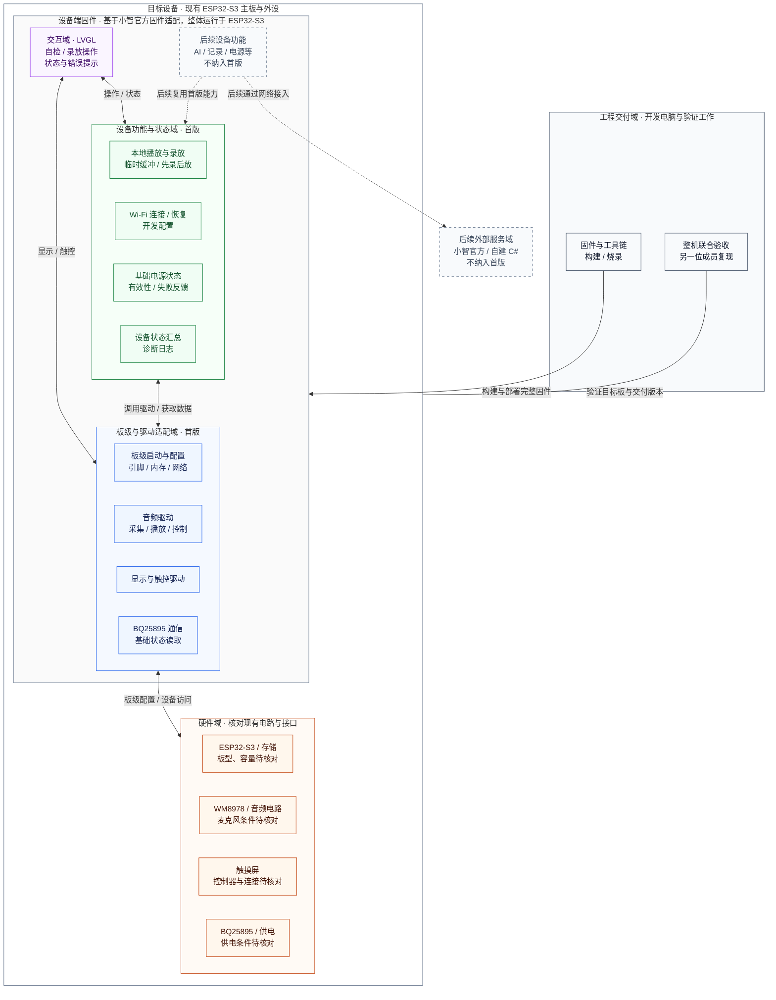

# BYAI 产品需求文档：首版硬件适配样机

这份文档面向第一次接手 BYAI 的项目成员，说明项目要做什么、目前有哪些基础，以及接下来按什么顺序推进。具体实现与测试记录放在对应 Issue，最新进度查看 [开发路线 Project](https://github.com/users/mmsakaito/projects/1)。

**现在可以先开始的工作：收集目标板资料，同时固定小智官方固件和工具链；有了板级参数与构建产物后，再完成烧录、启动和联网。** 麦克风输入是否具备条件要尽早核对，不能等到整机联调时才发现缺少输入路径。

## 1. 我们要做什么

BYAI 的长期目标是一个带触摸屏的 AI 语音交互终端：用户可以和设备说话，通过屏幕查看状态并进行操作。项目使用 ESP32-S3 作为主控，以小智官方固件——运行在设备上的程序——作为软件起点，逐步适配现有硬件并增加功能。

第一版面向团队内部使用，先交付一台**主要硬件都能工作、可以录音回放、其他成员也能按文档搭建起来的样机**。先完成这一版，是为了给后续 AI 对话提供可靠的录音、播放、显示、网络和供电基础。

现有方案中，几个主要部件各自承担以下工作：

| 部件 | 在项目中的作用 |
| --- | --- |
| ESP32-S3 | 运行设备程序，协调网络、屏幕和音频等功能。 |
| WM8978 与音频电路 | 承接麦克风输入和声音输出；实际麦克风连接尚待核对。 |
| 2.4 英寸电容触摸屏 | 显示设备状态，提供录音、回放等操作入口。界面使用 LVGL 图形库。 |
| BQ25895 与现有电源电路 | 为电源状态读取与后续充电管理提供硬件基础。 |

完整芯片清单见 [README 的硬件配置](../README.md)。首版固定现有芯片和主板；如果发现必须新增硬件或改板，先记录原因，再重新讨论范围。

### 架构总览：硬件、软件和开发工作分别在哪里

下图按开发职责划分目标架构，首版软件均待适配与验证。设备固件整体运行在 ESP32-S3 上；分组不代表独立进程或线程，连线表示逻辑接口或交付关系，不是原理图接线，也不是开发先后顺序。图中只画域间主要关系：实线对应首版接口与交付，虚线对应后续扩展；硬件节点内另行标注待核对条件。

可以按下面的分工找到自己的开发入口；具体先后顺序见第四节。

| 开发域 | 需要负责什么 | 从哪里开始 |
| --- | --- | --- |
| 硬件核对 | 确认实际板卡、引脚、音频输入输出、屏幕和供电条件，记录未确认项。 | [板卡资料](https://github.com/mmsakaito/BYAI/issues/9)、[音频路径](https://github.com/mmsakaito/BYAI/issues/12)、[麦克风条件](https://github.com/mmsakaito/BYAI/issues/39) |
| 板级与驱动 | 让程序在目标板启动，提供可复用的采集、播放、显示触控和电源通信接口。 | [板级启动](https://github.com/mmsakaito/BYAI/issues/9)、[音频控制](https://github.com/mmsakaito/BYAI/issues/13)、[显示触控](https://github.com/mmsakaito/BYAI/issues/16)、[电源通信](https://github.com/mmsakaito/BYAI/issues/24) |
| 设备功能与状态 | 组合驱动能力，实现录放、联网恢复、基础电源状态及失败反馈。 | [网络验证](https://github.com/mmsakaito/BYAI/issues/10)、[输入采集](https://github.com/mmsakaito/BYAI/issues/40)、[录放联调](https://github.com/mmsakaito/BYAI/issues/41)、[基础电源状态](https://github.com/mmsakaito/BYAI/issues/27) |
| 交互界面 | 提供自检与录放操作入口，展示真实状态，让用户知道正在做什么或哪里失败。 | [LVGL 自检界面](https://github.com/mmsakaito/BYAI/issues/17) |
| 工程交付与验证 | 固定版本和构建环境，整理烧录与诊断说明，验证整机并完成他人复现。 | [构建基线](https://github.com/mmsakaito/BYAI/issues/8)、[整机验收](https://github.com/mmsakaito/BYAI/issues/42)、[他人复现](https://github.com/mmsakaito/BYAI/issues/43) |
| 后续设备与服务扩展 | 首版基础具备后再明确 AI、记录、完整电源、自建服务及其他应用的具体方案。 | [后续路线](#6-首版之后做什么) |

图中“基础电源状态”只包含实际可读的状态，不包含电量估算或完整充电控制。录音使用临时缓冲，不引入聊天记录存储；后续服务节点也不表示首版需要联网建立 AI 会话。

## 2. 目前做到哪里了

目前仓库已经有项目说明、贡献规范、这份 PRD，以及 GitHub 上拆分好的开发任务。**仓库尚未提交固件、构建系统或自动化测试，也没有可据此确认硬件已通过验收的交付记录。** 文中的功能与测试指标都是接下来的目标。

接手时需要补齐的关键资料如下。已有资料可以沿用，但要确认与手里的板一致；未知项应明确记录。

| 需要拿到或确认的资料 | 为什么现在需要 |
| --- | --- |
| 实际板卡版本、原理图、引脚表、供电方式 | 判断程序应如何配置，以及外设实际接在哪里。 |
| Flash、PSRAM 容量，显示与触控控制器、分辨率及总线 | 决定板级配置、驱动与可用内存，不能只凭“ESP32-S3”推断。 |
| 麦克风是否存在、连接方式、WM8978 输入路径 | 决定能否完成首版录音；目前尚未确认。 |
| WM8978、功放与扬声器连接，电源芯片可读状态 | 明确输出与基础电源验证条件，芯片标称值不能代替本板实测。 |
| 小智官方固件来源与版本、工具链和依赖版本 | 让所有成员从同一软件基线开始，并能重复构建。 |

如果已有尚未入库的固件或测试记录，先核对版本并补入项目记录。缺失的信息整理为硬件参数表、引脚表和缺口台账，注明影响、证据和下一步动作。

## 3. 第一版交付后，应该能怎么用

一次完整的样机演示应当是这样的：

1. 成员按文档准备环境、构建并烧录固件，使用固件已有的开发配置入口设置 Wi-Fi。首版不要求在触屏上输入 Wi-Fi 密码。
2. 设备启动后进入自检界面，显示真实的网络与外设状态；失败时能够看到错误或不可用提示，并通过日志定位。
3. 点击播放测试音频，能够听到声音，并操作音量、静音和停止。
4. 点击录音，说一段 5 秒的测试语句，停止后点击回放，能够听清刚才录下的内容。屏幕能区分空闲、录音、可回放、播放和失败状态，录放过程中仍可响应触控。
5. 在自检界面查看实际可读取的基础电源状态；读取失败时显示不可用或错误。
6. 网络、屏幕和音频一起运行时，设备能够持续工作；另一位成员拿到同一版本与说明后，也能完成环境准备到自检的全过程。

录音采用**先录后放**，只使用运行期间的临时缓冲，不要求跨重启保存或导出。首版不要求同时录放、语音唤醒、回声消除或连接 AI 服务。

## 4. 接手后按什么顺序推进

整体顺序是：**确认资料与软件基线 → 启动和联网 → 分别打通外设 → 接通触屏录音回放 → 整机验收与交接。** 不必等一个完整大模块全部结束，才开始另一个已经具备条件的任务。

### 第一步：拿清楚硬件资料，建立可构建的软件基线

硬件资料核对和软件环境准备可以并行开展。

- 按上一节收集板卡资料，核对版本、容量、引脚和供电条件；提前调查麦克风是否存在，记录尚不清楚的连接。
- 确定小智官方固件来源、分支与提交，记录许可证、工具链和依赖，先完成基线构建。
- 从此时开始记录实际执行的配置和步骤，后面的成员将依靠这些说明复现。

**这一步的结果：** 有可追溯的构建产物，以及足以开展板级适配的参数与缺口清单。当前仓库没有可直接使用的构建命令，需要由这一步验证后写入说明。

任务入口：[固件基线与构建环境](https://github.com/mmsakaito/BYAI/issues/8)、[目标板参数与启动适配](https://github.com/mmsakaito/BYAI/issues/9)、[硬件缺口记录](https://github.com/mmsakaito/BYAI/issues/11)。[麦克风输入路径核对](https://github.com/mmsakaito/BYAI/issues/39)所需的资料先收集，实际输入路径结合后续音频硬件核对完成。

### 第二步：让目标板启动，能看日志、能联网

基线可构建且板级参数明确后，配置目标板并完成烧录。先通过日志确认启动和初始化结果，再验证开发配置方式下的 Wi-Fi 连接、重启后连接及断网恢复。

**这一步的结果：** 板能进入运行状态，启动和网络问题有可定位的日志，相关配置与烧录步骤已记录。完整自检界面在下一步实现，此时不需要等待触屏配网或 AI 服务。

任务入口：[目标板启动与调试](https://github.com/mmsakaito/BYAI/issues/9)、[基础联网验证](https://github.com/mmsakaito/BYAI/issues/10)、[更新缺口台账](https://github.com/mmsakaito/BYAI/issues/11)。

### 第三步：分别打通音频、屏幕和基础电源

板级启动与各自硬件条件具备后，下面三条线可以并行推进。每条线先提供可单独检查的结果，再接入自检界面。

| 工作线 | 接下来做什么 | 这条线先交付什么 |
| --- | --- | --- |
| 音频 | 核对总线、时钟、功放与麦克风路径；完成 WM8978 控制，分别实现测试音频输出与麦克风采集。 | 能播放已知音频、调节音量和静音；输入条件可用时，能采集一段可供回放的数据。 |
| 显示与触控 | 适配屏幕和触控，建立 LVGL 自检界面，提供状态显示与录放操作入口。 | 画面正常、触点准确，能响应操作；状态接口可供音频和电源接入。 |
| 基础电源 | 核对并验证实际供电方式，识别 BQ25895，读取实际可用的基础状态。 | 有可重复读取的状态与失败反馈；界面准备好后显示这些结果。 |

任务入口：

- 音频：[硬件路径](https://github.com/mmsakaito/BYAI/issues/12) → [初始化与控制](https://github.com/mmsakaito/BYAI/issues/13) → [音频输出](https://github.com/mmsakaito/BYAI/issues/14)；[麦克风路径核对](https://github.com/mmsakaito/BYAI/issues/39)通过后推进[输入采集](https://github.com/mmsakaito/BYAI/issues/40)。
- 显示与触控：[硬件驱动](https://github.com/mmsakaito/BYAI/issues/16) → [自检界面](https://github.com/mmsakaito/BYAI/issues/17)。
- 基础电源：[供电运行与芯片通信](https://github.com/mmsakaito/BYAI/issues/24) → [基础状态展示](https://github.com/mmsakaito/BYAI/issues/27)，展示同时需要自检界面。

麦克风条件不具备时，将录音相关工作记录为阻塞，继续推进已有条件的其他任务，不能用播放预置音频代替录音验收。基础电源展示只依赖通信和界面，不等待电量估算或电流采集。

### 第四步：把触屏、录音和播放接成完整操作

当输入采集、音频输出和自检界面都已具备时，实现第三节描述的“开始录音 → 停止 → 回放”流程。连接操作事件、临时缓冲与界面状态，检查失败提示和重复操作，并确认录放期间触控仍能响应。

**这一步的结果：** 成员能够在设备上录下并听到自己的 5 秒测试语句，播放控制有效，画面与实际状态一致。

任务入口：[触屏录音与本地回放](https://github.com/mmsakaito/BYAI/issues/41)、[音频输入输出及异常检查](https://github.com/mmsakaito/BYAI/issues/15)。

### 第五步：先做整机验收，再交给另一位成员复现

先固定一个候选固件版本，按照下一节完成整机功能和稳定性测试。通过后，把同一版本、配置说明和操作文档交给另一位成员，由其执行环境准备、构建、烧录、启动和自检，补齐文档遗漏。

**这一步的结果：** 有一套通过首版验收、可追溯且可由他人复现的交付物。整机测试先完成，他人复现随后执行；两项都通过才算首版交付完成。

任务入口：[整机联合验收](https://github.com/mmsakaito/BYAI/issues/42) → [另一位成员复现](https://github.com/mmsakaito/BYAI/issues/43)。

## 5. 做到什么程度算首版完成

下面的标准是待验证目标。硬件相关测试在实际目标板上执行，记录板卡版本、固件版本、关键配置、测试条件与结果。

| 验收场景 | 通过条件 |
| --- | --- |
| 他人复现 | 另一位成员按文档完成环境准备、构建、烧录、启动与自检，没有未记录的必要步骤。 |
| 重复启动 | 连续完成 10 次重启，每次均进入自检界面，预期外设初始化完成、网络状态正确；日志能区分启动、初始化和运行异常。 |
| 音频输出 | 已知测试音频能够播放，音量、静音和停止操作有效。 |
| 录音回放 | 完成 10 轮“录制 5 秒语句 → 停止 → 回放”，内容可辨识、无明显截断，状态与操作一致。 |
| 显示与触控 | 显示、触点和操作位置一致；录音与回放期间界面仍能响应触控。 |
| 网络恢复 | 完成一次主动断网与恢复验证，界面准确反馈，恢复后能够重新联网。 |
| 电源通信 | BQ25895 可识别并重复读取基础状态，读取失败时显示不可用或错误，不误报正常。 |
| 联合运行 | 保持联网、界面刷新与触控操作，循环播放测试音频至少 30 分钟，无崩溃、意外重启、界面卡死或播放链路中断。 |

交接时需要同时提供：固件源码和板级配置、上游与工具链版本、构建烧录及自检说明、硬件参数表与引脚表、测试日志和演示证据、已知限制与缺口台账。凭据与个人配置不得提交到仓库或出现在交付日志中。

如果某项未通过或被硬件条件阻塞，保留实际结果与原因，不能用其他项目的通过结果替代。首版具体任务与交付进度见 [首版 Milestone](https://github.com/mmsakaito/BYAI/milestone/1)。

## 6. 首版之后做什么

后续方向保留，但不作为首版验收条件，也不承诺交付日期。

| 后续方向 | 要带来的能力 |
| --- | --- |
| 完整基础体验 | 在已验证的硬件上完成 AI 语音对话，再推进触屏配网、完整状态表情、聊天记录持久化、电量估算与校准、电流采集、完整充电控制和综合电源展示。 |
| 自建服务扩展 | 先明确 C# 服务端和设备端各自负责什么，再推进服务切换、模型选择、在线状态和音乐资源。 |
| 实验探索 | 验证 Windows 95、NDS 等模拟器的可行性，通过后再决定虚拟触控手柄等配套功能。 |

探索可以得出可行、部分可行或不可行的结论。若结论不支持后续实现，记录原因并将相应任务以 `not planned` 关闭，不记作功能已实现。

## 附录：查任务与更新记录

日常使用时，先按第四节找到当前步骤和具体 Issue；需要核对需求覆盖时，再查下表。一个 Epic 是一组相关任务的集合，Project 保留七个模块 Epic，子 Issue 负责具体实施和验收。

| 需求编号 | 要交付的能力 | 对应任务 |
| --- | --- | --- |
| HW-01 | 可复现的构建与烧录 | [构建环境](https://github.com/mmsakaito/BYAI/issues/8)、[他人复现](https://github.com/mmsakaito/BYAI/issues/43) |
| HW-02 | 启动与诊断 | [板级启动](https://github.com/mmsakaito/BYAI/issues/9)、[缺口台账](https://github.com/mmsakaito/BYAI/issues/11) |
| NET-01 | 基础联网 | [网络验证](https://github.com/mmsakaito/BYAI/issues/10) |
| UI-01 | 显示、触控与自检界面 | [驱动](https://github.com/mmsakaito/BYAI/issues/16)、[界面](https://github.com/mmsakaito/BYAI/issues/17) |
| AUD-01 | 音频输出及播放控制 | [硬件路径](https://github.com/mmsakaito/BYAI/issues/12)、[控制](https://github.com/mmsakaito/BYAI/issues/13)、[输出](https://github.com/mmsakaito/BYAI/issues/14)、[检查](https://github.com/mmsakaito/BYAI/issues/15) |
| AUD-02 | 麦克风采集与本地回放 | [输入路径](https://github.com/mmsakaito/BYAI/issues/39)、[采集](https://github.com/mmsakaito/BYAI/issues/40)、[回放](https://github.com/mmsakaito/BYAI/issues/41)、[检查](https://github.com/mmsakaito/BYAI/issues/15) |
| PWR-01 | 供电运行、基础通信与状态 | [供电与通信](https://github.com/mmsakaito/BYAI/issues/24)、[状态展示](https://github.com/mmsakaito/BYAI/issues/27) |
| SYS-01 | 联合运行与首版交付 | [整机验收](https://github.com/mmsakaito/BYAI/issues/42)、[他人复现](https://github.com/mmsakaito/BYAI/issues/43) |

完整电源管理后续由 [电量估算](https://github.com/mmsakaito/BYAI/issues/25)、[电流采集](https://github.com/mmsakaito/BYAI/issues/26)、[充电控制与综合状态](https://github.com/mmsakaito/BYAI/issues/44) 承接；其他后续方向可从 [AI 与数据存储](https://github.com/mmsakaito/BYAI/issues/4)、[自建服务](https://github.com/mmsakaito/BYAI/issues/6)、[实验探索](https://github.com/mmsakaito/BYAI/issues/7) 进入。

- PRD 说明目标、范围、工作顺序和完成标准；调整需求时同步更新对应内容与 Issue。
- 实施过程中的配置、日志、问题和结论写入具体 Issue。任务被阻塞时说明缺失条件，验收通过并补齐交付记录后再标记完成。
- 模块实施依赖具体的构建、启动或联网任务，不等待包含整机验收的基础适配 Epic 整体关闭。
- 跨版本 Epic 不绑定单一版本 Milestone；首版通过不等于模块中的所有后续任务完成。
- 分支、签名提交和 PR 操作遵循 [贡献指南](../CONTRIBUTING.md)。
