# BYAI 产品需求文档：首版硬件适配样机

这份文档面向第一次接手 BYAI 的项目成员，说明项目要做什么、目前有哪些基础，以及接下来按什么顺序推进。具体实现与测试记录放在对应 Issue，最新进度查看 [开发路线 Project](https://github.com/users/mmsakaito/projects/1)。

**接手后先把第一块板装起来并验证稳定上电；软件从 ESP-IDF 例程起步，逐个接入板上模块，全部联通后再适配小智。** 最新工程原理图 P2 已标出 WM8978 编解码器和 MEMS 麦克风；图纸信息用于指导测试，不能替代实板验证。

## 1. 我们要做什么

BYAI 的长期目标是一个带触摸屏的 AI 语音交互终端：用户可以和设备说话，通过屏幕查看状态并进行操作。项目使用 ESP32-S3 作为主控。首版先用 ESP-IDF `hello_world` 例程建立最小固件骨架，按模块验证并集成现有硬件；设备各模块和整机流程打通后，再将已验证的板级能力适配到小智固件。

第一版面向团队内部使用，先完成一台**主要硬件都能工作、可以录音回放的验证样机**，再制作多块同版样机供团队成员并行开发。每位成员都应能按文档构建固件、烧录并检查自己负责的模块，为后续 AI 对话提供可靠的录音、播放、显示、网络和供电基础。

现有方案中，几个主要部件各自承担以下工作：

| 部件 | 在项目中的作用 |
| --- | --- |
| ESP32-S3-WROOM-1-N16R8（U4） | 原理图已确认的主控模组型号；作为首版板级配置基线。 |
| W25Q128JVPIQ（U5） | 原理图已确认的外部 Flash 型号；规格可按型号查阅，固件映射在集成时落实。 |
| WM8978GEFL/RV（U6）、LMA2718B381-OAK02 麦克风（U10）与 NS4110B（U8） | P2 已确认的音频器件型号；按现有图纸和引脚资料开展适配，功能结果进入整机验收。 |
| 2.4 英寸电容触摸屏 | 首版交互目标已确认；原理图标出 FPC1（16 pin），屏幕/触控控制器型号和接口细节待补。界面使用 LVGL 图形库。 |
| BQ25890RTWT（U2）与现有电源电路 | 原理图已确认器件型号和电源方案；首版只保留基础通信与状态读取验收。 |

完整芯片清单见 [README 的硬件配置](../README.md)。首版固定现有芯片和主板；如果发现必须新增硬件或改板，先记录原因，再重新讨论范围。

### 架构总览：硬件、软件和开发工作分别在哪里

下图按开发职责划分目标架构，首版软件均待适配与验证。设备固件整体运行在 ESP32-S3 上；分组不代表独立进程或线程，连线表示逻辑接口或交付关系，不是原理图接线，也不是开发先后顺序。图中只画域间主要关系：实线对应首版接口与交付，虚线对应后续扩展；硬件节点内另行标注待核对条件。

```mermaid
flowchart TB
    subgraph Engineering["工程交付域 · 开发电脑与验证工作"]
        direction LR
        Build["固件与工具链<br/>构建 / 烧录"]
        Verify["整机联合验收<br/>另一位成员复现"]
    end

    subgraph Device["目标设备 · 现有 ESP32-S3 主板与外设"]
        subgraph Firmware["设备端固件 · ESP-IDF 例程起步，整机打通后适配小智"]
            UI["交互域 · LVGL<br/>自检 / 录放操作<br/>状态与错误提示"]

            subgraph Features["设备功能与状态域 · 首版"]
                direction LR
                Audio["本地播放与录放<br/>临时缓冲 / 先录后放"]
                Network["Wi-Fi 连接 / 恢复<br/>开发配置"]
                PowerState["基础电源状态<br/>有效性 / 失败反馈"]
                Diagnostics["设备状态汇总<br/>诊断日志"]
            end

            subgraph Drivers["板级与驱动适配域 · 首版"]
                direction LR
                Board["板级启动与配置<br/>引脚 / 内存 / 网络"]
                AudioDriver["音频驱动<br/>采集 / 播放 / 控制"]
                DisplayDriver["显示与触控驱动"]
                PowerDriver["BQ25890RTWT 通信<br/>基础状态读取"]
            end

            LaterDevice["后续设备功能<br/>AI / 记录 / 电源等<br/>不纳入首版"]
        end

        subgraph Hardware["硬件域 · 核对现有电路与接口"]
            direction LR
            MainBoard["ESP32-S3-WROOM-1-N16R8 / W25Q128<br/>器件与板卡资料已确认"]
            AudioHardware["WM8978 / MEMS 麦克风 / NS4110B<br/>器件已确认，功能按验收验证"]
            Screen["2.4 英寸电容触摸屏 / FPC1（16 pin）<br/>控制器与接口细节待补"]
            PowerHardware["BQ25890RTWT / 供电<br/>图纸已确认，基础通信按验收验证"]
        end
    end

    LaterServices["后续外部服务域<br/>小智官方 / 自建 C#<br/>不纳入首版"]

    Build -->|"构建与部署完整固件"| Firmware
    Verify ---|"验证目标板与交付版本"| Device
    UI <-->|"操作 / 状态"| Features
    UI <-->|"显示 / 触控"| Drivers
    Features <-->|"调用驱动 / 获取数据"| Drivers
    Drivers <-->|"板级配置 / 设备访问"| Hardware
    LaterDevice -.->|"后续复用首版能力"| Features
    LaterDevice -.->|"后续通过网络接入"| LaterServices

    classDef hardware fill:#fff7ed,stroke:#c2410c,color:#431407
    classDef driver fill:#eff6ff,stroke:#2563eb,color:#172554
    classDef feature fill:#f0fdf4,stroke:#15803d,color:#14532d
    classDef interface fill:#faf5ff,stroke:#9333ea,color:#3b0764
    classDef engineering fill:#f8fafc,stroke:#475569,color:#0f172a
    classDef later fill:#f8fafc,stroke:#64748b,color:#334155,stroke-dasharray:5 5
    class MainBoard,AudioHardware,Screen,PowerHardware hardware
    class Board,AudioDriver,DisplayDriver,PowerDriver driver
    class Audio,Network,PowerState,Diagnostics feature
    class UI interface
    class Build,Verify engineering
    class LaterDevice,LaterServices later
    style Device fill:#ffffff,stroke:#64748b
    style Firmware fill:#fafafa,stroke:#64748b
    style Hardware fill:#fffaf5,stroke:#c2410c
    style Drivers fill:#f5f9ff,stroke:#2563eb
    style Features fill:#f6fff8,stroke:#15803d
    style Engineering fill:#f8fafc,stroke:#475569
```

可以按下面的分工找到自己的开发入口；具体先后顺序见第四节。

| 开发域 | 需要负责什么 | 从哪里开始 |
| --- | --- | --- |
| 硬件核对 | 确认实际板卡、引脚、音频输入输出、屏幕和供电条件，记录未确认项。 | [板卡资料](https://github.com/mmsakaito/BYAI/issues/9)、[音频路径](https://github.com/mmsakaito/BYAI/issues/12)、[麦克风条件](https://github.com/mmsakaito/BYAI/issues/39) |
| 板级与驱动 | 让程序在目标板启动，提供可复用的采集、播放、显示触控和电源通信接口。 | [板级启动](https://github.com/mmsakaito/BYAI/issues/9)、[音频控制](https://github.com/mmsakaito/BYAI/issues/13)、[显示触控](https://github.com/mmsakaito/BYAI/issues/16)、[电源通信](https://github.com/mmsakaito/BYAI/issues/24) |
| 设备功能与状态 | 组合驱动能力，实现录放、联网恢复、基础电源状态及失败反馈。 | [网络验证](https://github.com/mmsakaito/BYAI/issues/10)、[输入采集](https://github.com/mmsakaito/BYAI/issues/40)、[录放联调](https://github.com/mmsakaito/BYAI/issues/41)、[基础电源状态](https://github.com/mmsakaito/BYAI/issues/27) |
| 交互界面 | 提供自检与录放操作入口，展示真实状态，让用户知道正在做什么或哪里失败。 | [LVGL 自检界面](https://github.com/mmsakaito/BYAI/issues/17) |
| 工程交付与验证 | 固定版本和构建环境，整理烧录与诊断说明，验证整机并完成他人复现。 | [构建基线](https://github.com/mmsakaito/BYAI/issues/8)、[整机验收](https://github.com/mmsakaito/BYAI/issues/42)、[他人复现](https://github.com/mmsakaito/BYAI/issues/43) |
| 后续设备与服务扩展 | 首版基础具备后再明确 AI、记录、完整电源、自建服务及其他应用的具体方案。 | [后续路线](#6-首版之后做什么) |

图中“基础电源状态”只包含实际可读的状态，不包含电量估算或完整充电控制。录音使用临时缓冲，不引入聊天记录存储；后续服务节点也不表示首版需要联网建立 AI 会话。

## 2. 目前做到哪里了

目前仓库已经有项目说明、贡献规范、这份 PRD，以及 GitHub 上拆分好的开发任务。**仓库尚未提交固件、构建系统或自动化测试，也没有可据此确认硬件已通过验收的交付记录。** 文中的功能与测试指标都是接下来的目标。

目标板工程资料已经取得：版本为 `20261001`，`byai` 工程含 P1/P2 原理图、PCB、引脚表和供电方案。主控、外部 Flash、音频和电源芯片型号也已记录在 [README 硬件配置](../README.md) 中；这些不再列为待收集项。

### 仍缺少的硬件资料

| 项目 | 已知信息与待补内容 |
| --- | --- |
| 显示/触控模组 | 已确认 2.4 英寸电容触摸屏，原理图有 FPC1（16 pin）；屏幕和触控控制器的具体型号及其驱动资料由后续屏幕资料补齐。 |

固件上游来源、版本、工具链和依赖版本属于软件构建基线，应在开始构建前确定，不属于板卡资料缺口。其余硬件信息已在工程或本 PRD 中记录：Flash 型号可查标称规格，引脚与供电方案以已取得的工程为依据。音频输入/输出及 BQ25890RTWT 基础状态读取属于实施与验收，不是缺少型号。本版不追踪电池型号/容量，也暂不要求外接扬声器型号/阻抗。

## 3. 第一版交付后，应该能怎么用

一次完整的样机演示应当是这样的：

1. 成员按文档准备环境、构建并烧录固件，使用固件已有的开发配置入口设置 Wi-Fi。首版不要求在触屏上输入 Wi-Fi 密码。
2. 设备启动后进入自检界面，显示真实的网络与外设状态；失败时能够看到错误或不可用提示，并通过日志定位。
3. 点击播放测试音频，能够听到声音，并操作音量、静音和停止。
4. 点击录音，说一段 5 秒的测试语句，停止后点击回放，能够听清刚才录下的内容。屏幕能区分空闲、录音、可回放、播放和失败状态，录放过程中仍可响应触控。
5. 在自检界面查看实际可读取的基础电源状态；读取失败时显示不可用或错误。
6. 网络、屏幕和音频一起运行时，设备能够持续工作；另一位成员拿到同一版本与说明后，也能完成环境准备到自检的全过程。

录音采用**先录后放**，只使用运行期间的临时缓冲，不要求跨重启保存或导出。首版不要求同时录放、语音唤醒、回声消除或连接 AI 服务。

## 4. 接手后按什么顺序推进

推进分成软硬件两条线。硬件线按**首板装配与稳定上电 → 逐模块测试固件验证 → 制作多块同版样机并分发**；软件线按**ESP-IDF 例程骨架 → 逐模块接入 → 全部模块联调 → 适配小智**。两条线可并行准备，但给板子刷模块固件前，必须先完成首板上电检查。

### 阶段一：装配首板，确认可以稳定上电

先按 `20261001` 工程装配一块样板。上电前检查焊接、器件方向、连接器和电源相关线路；首次上电按工程记录的供电方式操作，观察有无异常发热、异味、异响或电源反复启停。重复断电、上电并记录每次结果；若发现异常，先停电排查，不继续刷写。

**通过条件：** 首板能重复上电并保持运行，没有观察到异常现象；记录板卡版本、供电方式、检查结果和待处理问题。这里确认的是初步上电稳定性，不等于各外设功能已经通过。

### 阶段二：搭建 ESP-IDF 起步工程

软件以仓库 `firmware/` 中的 `esp_wifi_service` 例程为起步工程，使用 ESP-IDF `v6.1`。先整理本机环境配置，完成构建、烧录、串口日志和重启验证；再把例程中与产品无关的演示逻辑收敛为清晰的应用入口、板级配置位置和模块接口。

**通过条件：** 团队成员能按文档构建并烧录该起步工程，设备能启动并输出可辨认的日志。此阶段不引入小智代码，也不把尚未验证的外设功能写成已完成。

任务入口：[固件基线与构建环境](https://github.com/mmsakaito/BYAI/issues/8)、[目标板参数与启动适配](https://github.com/mmsakaito/BYAI/issues/9)。

### 阶段三：逐模块刷测试固件，验证板上线路

首板通过上电检查后，为各硬件模块准备尽量独立、可判定结果的测试固件；每次只验证一类接口或功能，保存固件版本、烧录步骤、串口日志和实测结果。建议按下表覆盖原理图中已确认的模块：

| 模块 | 测试固件要验证的内容 | 记录的结果 |
| --- | --- | --- |
| ESP32-S3 与外部 Flash | 启动、日志、板级配置与可用 Flash 访问；确认启动过程稳定。 | 启动日志、访问结果、重启结果。 |
| Wi-Fi | 以乐鑫 [`esp_wifi_service`](https://components.espressif.com/components/espressif/esp_wifi_service) 的 `wifi_service_example` 为起步，使用 SoftAP 与网页配网门户扫描并连接现有 AP，验证网络配置文件的保存、管理、断线重连与获取 IP。网页门户通过设备配网热点访问；若需在设备已连接的局域网内管理网络，需另行实现。 | 记录配网流程、连接/重连状态、获取到的 IP、配置文件保存结果和错误日志。SSID 与密码仅作本机测试配置，不提交到仓库。 |
| 显示与触控 | 驱动屏幕显示测试画面并读取触摸事件；控制器和接口细节补齐后再定具体驱动。 | 画面、触点位置与响应情况；缺少屏幕型号时标注阻塞。 |
| WM8978、麦克风与 NS4110B 音频路径 | 分别验证已知音频输出和麦克风采集，确认采集数据可检查或回放。 | 输入、输出各自的实测结果及对应日志。 |
| TF 卡 | 检测卡片并执行可安全重复的读写验证。 | 卡片识别和读写结果；测试文件清理方式。 |
| BQ25890RTWT | 验证芯片通信并读取首版约定的基础状态。 | 识别、状态读取和失败反馈。 |

先确认模块所需的屏幕资料和接线条件，再编写对应测试固件；暂时不能验证的项目明确记录原因，不用图纸信息代替实测。音频输入链路若未通过，录音任务记为阻塞，不能以播放预置音频替代。

任务入口：[目标板参数与启动适配](https://github.com/mmsakaito/BYAI/issues/9)、[基础联网验证](https://github.com/mmsakaito/BYAI/issues/10)、[音频硬件路径](https://github.com/mmsakaito/BYAI/issues/12)、[音频控制](https://github.com/mmsakaito/BYAI/issues/13)、[屏幕与触控](https://github.com/mmsakaito/BYAI/issues/16)、[供电与芯片通信](https://github.com/mmsakaito/BYAI/issues/24)、[麦克风路径核对](https://github.com/mmsakaito/BYAI/issues/39)。

### 阶段四：复制样板并分发给团队成员

首板完成阶段三的可测模块检查后，按同一工程版本制作多块样机并分发给团队成员。每块板随附板卡版本标记、模块测试固件及其烧录说明、已通过和未通过的检查记录；由领用成员按说明复测自己负责的模块并回报差异。复制数量和领用人根据团队实际安排确定。

**通过条件：** 分发的板卡都能对应到明确的硬件版本和测试记录；团队知道各自拿到的板卡可用范围与遗留问题。不要把未经检查的板当作已验证样机分发。

### 阶段五：把各模块逐步接入同一固件

以 `hello_world` 骨架为主工程，一次接入一个已由测试固件验证的模块，先封装并验证驱动接口，再接入应用逻辑。建议顺序为启动与存储、网络、显示与触控、音频输入输出、基础电源状态；遇到屏幕资料等外部阻塞时，继续推进不依赖该项的模块。每接入一项都保留独立验证入口，避免多项同时改动后难以定位问题。

随后把模块组合成完整操作：启动自检、网络连接、屏幕状态显示、已知音频播放、触屏录制 5 秒语句并回放、电源基础状态读取。验证功能间没有资源冲突，连续运行和断网恢复符合第五节验收标准。

任务入口：[基础联网验证](https://github.com/mmsakaito/BYAI/issues/10)、[音频输出](https://github.com/mmsakaito/BYAI/issues/14)、[自检界面](https://github.com/mmsakaito/BYAI/issues/17)、[基础电源状态](https://github.com/mmsakaito/BYAI/issues/27)、[输入采集](https://github.com/mmsakaito/BYAI/issues/40)、[录放联调](https://github.com/mmsakaito/BYAI/issues/41)。

### 阶段六：整机打通后再适配小智

只有当例程主工程中的板级启动、网络、显示触控、音频输入输出及本版要求的基础电源状态都完成集成和联合验证后，才开始适配小智。届时先确定小智上游仓库、版本、许可证、工具链和依赖；把已验证的板级驱动和配置接入目标版本，重新执行构建、烧录、启动及功能回归。若小智适配改变底层驱动或引入资源冲突，回到对应模块测试和整机联调，不跳过验收。

**最终交付：** 例程阶段的模块测试记录、整机固件和联合验收记录、小智适配版本与构建说明，以及成员所领板卡的版本和复测记录都可追溯。任务入口：[整机联合验收](https://github.com/mmsakaito/BYAI/issues/42)、[另一位成员复现](https://github.com/mmsakaito/BYAI/issues/43)。

## 5. 做到什么程度算首版完成

下面的标准是待验证目标。硬件相关测试在实际目标板上执行，记录板卡版本、固件版本、关键配置、测试条件与结果。

| 验收场景 | 通过条件 |
| --- | --- |
| 他人复现 | 另一位成员按文档完成环境准备、构建、烧录、启动与自检，没有未记录的必要步骤。 |
| 硬件样机分发 | 多块同版样机均有版本标记和对应的模块测试记录；领用成员按说明复测并反馈差异。 |
| 重复启动 | 连续完成 10 次重启，每次均进入自检界面，预期外设初始化完成、网络状态正确；日志能区分启动、初始化和运行异常。 |
| 音频输出 | 已知测试音频能够播放，音量、静音和停止操作有效。 |
| 录音回放 | 完成 10 轮“录制 5 秒语句 → 停止 → 回放”，内容可辨识、无明显截断，状态与操作一致。 |
| 显示与触控 | 显示、触点和操作位置一致；录音与回放期间界面仍能响应触控。 |
| 网络恢复 | 完成一次主动断网与恢复验证，界面准确反馈，恢复后能够重新联网。 |
| 电源通信 | BQ25890RTWT 可识别并重复读取基础状态，读取失败时显示不可用或错误，不误报正常。 |
| 联合运行 | 保持联网、界面刷新与触控操作，循环播放测试音频至少 30 分钟，无崩溃、意外重启、界面卡死或播放链路中断。 |

交接时需要同时提供：固件源码和板级配置、上游与工具链版本、构建烧录及自检说明、硬件参数表与引脚表、测试日志和演示证据、已知限制与缺口台账。凭据与个人配置不得提交到仓库或出现在交付日志中。

如果某项未通过或被硬件条件阻塞，保留实际结果与原因，不能用其他项目的通过结果替代。首版具体任务与交付进度见 [首版 Milestone](https://github.com/mmsakaito/BYAI/milestone/1)。

## 6. 首版之后做什么

后续方向保留，但不作为首版验收条件，也不承诺交付日期。

| 后续方向 | 要带来的能力 |
| --- | --- |
| 完整基础体验 | 在已验证的硬件上完成 AI 语音对话，再推进触屏配网、完整状态表情、聊天记录持久化、电量估算与校准、电流采集、完整充电控制和综合电源展示。 |
| 自建服务扩展 | 先明确 C# 服务端和设备端各自负责什么，再推进服务切换、模型选择、在线状态和音乐资源。 |
| 实验探索 | 验证 Windows 95、NDS 等模拟器的可行性，通过后再决定虚拟触控手柄等配套功能。 |

探索可以得出可行、部分可行或不可行的结论。若结论不支持后续实现，记录原因并将相应任务以 `not planned` 关闭，不记作功能已实现。

## 附录：查任务与更新记录

日常使用时，先按第四节找到当前步骤和具体 Issue；需要核对需求覆盖时，再查下表。一个 Epic 是一组相关任务的集合，Project 保留七个模块 Epic，子 Issue 负责具体实施和验收。

| 需求编号 | 要交付的能力 | 对应任务 |
| --- | --- | --- |
| HW-01 | 可复现的构建与烧录 | [构建环境](https://github.com/mmsakaito/BYAI/issues/8)、[他人复现](https://github.com/mmsakaito/BYAI/issues/43) |
| HW-02 | 启动与诊断 | [板级启动](https://github.com/mmsakaito/BYAI/issues/9)、[缺口台账](https://github.com/mmsakaito/BYAI/issues/11) |
| NET-01 | 基础联网 | [网络验证](https://github.com/mmsakaito/BYAI/issues/10) |
| UI-01 | 显示、触控与自检界面 | [驱动](https://github.com/mmsakaito/BYAI/issues/16)、[界面](https://github.com/mmsakaito/BYAI/issues/17) |
| AUD-01 | 音频输出及播放控制 | [硬件路径](https://github.com/mmsakaito/BYAI/issues/12)、[控制](https://github.com/mmsakaito/BYAI/issues/13)、[输出](https://github.com/mmsakaito/BYAI/issues/14)、[检查](https://github.com/mmsakaito/BYAI/issues/15) |
| AUD-02 | 麦克风采集与本地回放 | [输入路径](https://github.com/mmsakaito/BYAI/issues/39)、[采集](https://github.com/mmsakaito/BYAI/issues/40)、[回放](https://github.com/mmsakaito/BYAI/issues/41)、[检查](https://github.com/mmsakaito/BYAI/issues/15) |
| PWR-01 | 供电运行、基础通信与状态 | [供电与通信](https://github.com/mmsakaito/BYAI/issues/24)、[状态展示](https://github.com/mmsakaito/BYAI/issues/27) |
| SYS-01 | 联合运行与首版交付 | [整机验收](https://github.com/mmsakaito/BYAI/issues/42)、[他人复现](https://github.com/mmsakaito/BYAI/issues/43) |

完整电源管理后续由 [电量估算](https://github.com/mmsakaito/BYAI/issues/25)、[电流采集](https://github.com/mmsakaito/BYAI/issues/26)、[充电控制与综合状态](https://github.com/mmsakaito/BYAI/issues/44) 承接；其他后续方向可从 [AI 与数据存储](https://github.com/mmsakaito/BYAI/issues/4)、[自建服务](https://github.com/mmsakaito/BYAI/issues/6)、[实验探索](https://github.com/mmsakaito/BYAI/issues/7) 进入。

- PRD 说明目标、范围、工作顺序和完成标准；调整需求时同步更新对应内容与 Issue。
- 实施过程中的配置、日志、问题和结论写入具体 Issue。任务被阻塞时说明缺失条件，验收通过并补齐交付记录后再标记完成。
- 模块实施依赖具体的构建、启动或联网任务，不等待包含整机验收的基础适配 Epic 整体关闭。
- 跨版本 Epic 不绑定单一版本 Milestone；首版通过不等于模块中的所有后续任务完成。
- 分支、签名提交和 PR 操作遵循 [贡献指南](../CONTRIBUTING.md)。
