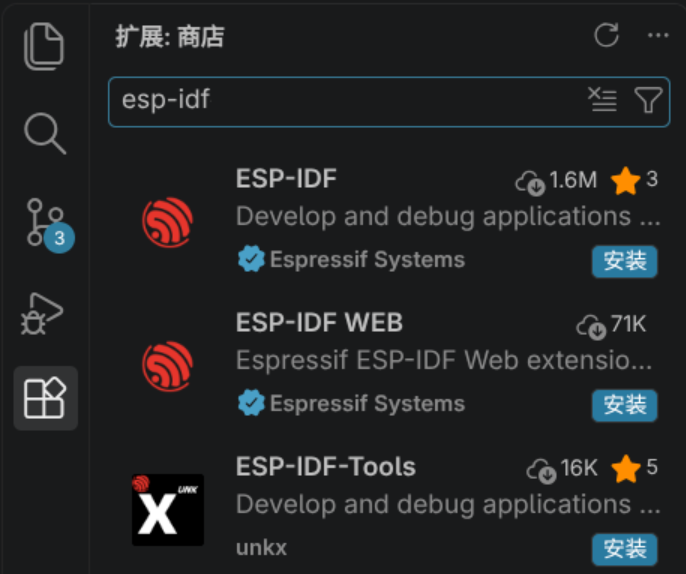
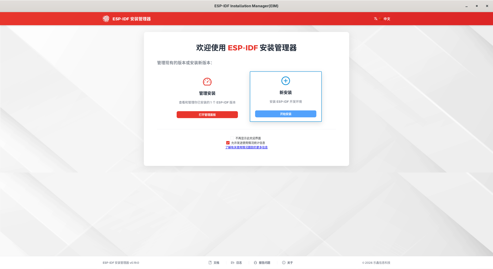
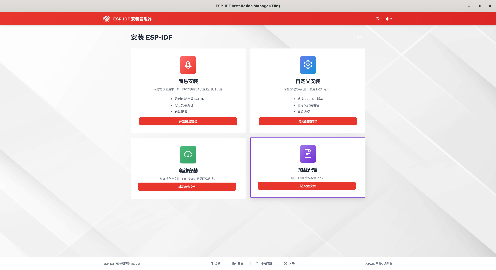
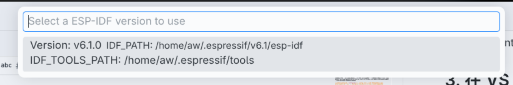

# 开发环境搭建

本文记录 BYAI 开发环境的安装入口和 VS Code 扩展配置。当前固件工程已接入，板级适配与实板验证仍待完成。

> 本文以仓库根目录的 [`config.toml`](../config.toml) 为安装配置。该文件目前指定 ESP32-S3、ESP-IDF `v6.1` 和 IDE 功能；实际安装程序及 VS Code 扩展版本会随时更新，以最新版本为准。

## 1. 安装 VS Code 与 ESP-IDF 扩展

1. 从 [VS Code 官网](https://code.visualstudio.com/download)安装适合当前系统的版本。
2. 打开扩展视图（Windows / Linux：`Ctrl+Shift+X`；macOS：`⌘+Shift+X`），搜索并安装 Espressif 官方扩展 ESP-IDF。

    >如图所示，安装第一个插件即可
    >
    >

## 2. 使用 EIM 安装 ESP-IDF

EIM（ESP-IDF Installation Manager）负责安装 ESP-IDF、所需工具及 Python 环境。访问[下载链接](https://dl.espressif.com/dl/eim/)并参考[乐鑫官方安装说明](https://docs.espressif.com/projects/esp-idf/zh_CN/latest/esp32/get-started/windows-setup.html)先安装 EIM，安装完毕后启动该程序。

1. 在 EIM 欢迎页点击 **新安装**，然后选择 **加载配置**，选择仓库根目录中的配置文件 [`config.toml`](../config.toml)。此处使用配置文件中的版本、目标芯片、工具、IDE 功能和镜像设置，无需再手动逐项选择。
2. 等待 EIM 显示安装成功，即可关闭 EIM。

    > 如下图所示，分别是欢迎界面和安装方式选择界面
    > 
    > 选择右侧“新安装”
    > 
    > 点击加载配置，在弹出窗口选择对应配置文件

如果导入配置文件出现问题请参阅：[乐鑫官方：在 Windows 上安装 ESP-IDF 及工具链（含 EIM 与配置文件）](https://docs.espressif.com/projects/esp-idf/zh_CN/latest/esp32/get-started/windows-setup.html) 进行 **自定义安装**，并按以下配置进行选择：

- 目标芯片（Target）：选择 `ESP32-S3`（配置值：`esp32s3`）。
- ESP-IDF 版本：选择 `v6.1`。
- 下载镜像：选择延迟最低的地址。
- 可选功能：勾选 `test-specific`、`ci`、`mcp` 和 `docs`。
- 工具选择：勾选 `cmake`。
- 安装路径：保持默认。

## 3. 在 VS Code 中配置 ESP-IDF

1. 重新打开 VS Code，按 `F1` 选择 `ESP-IDF: Select Current ESP-IDF Version`，选择本机安装的 `v6.1`。
2. 按 `F1` 输入 `ESP-IDF: Doctor Command`，检查扩展、ESP-IDF 路径和工具环境。

    > 如图所示，会自动识别已经安装的版本
    > 

3. 完整之后在最下方的状态栏选择芯片型号 `ESP32-S3`，然后点击构建(`🔧` 按钮)

如有异常请参阅：[ESP-IDF VS Code 扩展](https://docs.espressif.com/projects/vscode-esp-idf-extension/zh_CN/latest/installation.html#) 进行检查或者配置。
